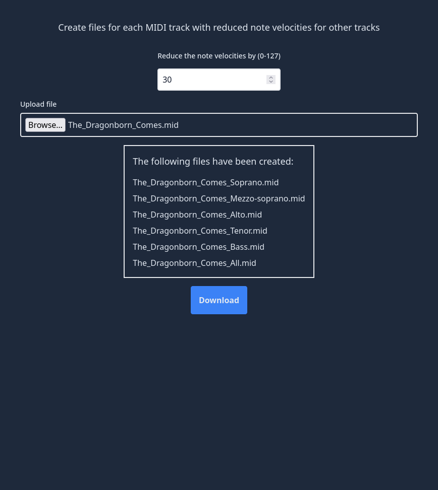

# MIDI Splitter

---

## Description

Splits a MIDI file into one MIDI file per track with note velocities for all other tracks.

Useful when creating separate MIDI files for different voices or instruments.

## Usage
To run locally use `trunk serve` to start the application.
For more information see the [trunk documentation](https://trunkrs.dev/)

## Development
The project is based on Leptos.
The Leptos book can be found [here](https://book.leptos.dev/) if you want to familiarise yourself with the framework.
